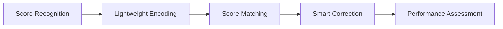

# 👋 Hi, I'm Lucas

**Building tools at the intersection of music, education, and code.**

---

## 🎹 About Me

- 🎓 Focused on **music education** and **score digitization**
- 🔭 Currently working on **[NoteLite](https://github.com/Lucas0623z/NoteLite)** — an OMR-based desktop platform for score recognition, structuring, and teaching feedback
- 🌱 Exploring **AI-assisted music workflows** (e.g. Gemini / Lyria integration)
- 💬 Ask me about **OMR**, **MusicXML**, **MIDI**, or **Java desktop apps**
- 📫 Reach me: open an [Issue](https://github.com/Lucas0623z/NoteLite/issues) or [Discussion](https://github.com/Lucas0623z/NoteLite/discussions) on NoteLite

---

## 🚀 Featured Project

### [NoteLite](https://github.com/Lucas0623z/NoteLite)

> An OMR-based platform for lightweight score structuring, error detection, and music-education evaluation.

| Capability | Description |
|------------|-------------|
| 📄 **OMR Pipeline** | PDF / image → transcription → MusicXML |
| 🎵 **MIDI Export** | Export `.mid` directly from the desktop app |
| 🇨🇳 **Localization** | Full Chinese UI (zh_CN) |
| 🖥️ **Desktop** | JDK 21, Gradle, cross-platform Java |

⬇️ [**Download latest release**](https://github.com/Lucas0623z/NoteLite/releases/latest)

---

## 🛠️ Tech Stack

  

  

  

  
  
  
  
  

### Languages & Runtime

| | |
|---|---|
| **Java** | JDK 17 / 21 · Swing desktop · `java.net.http` |
| **C / C++** | Native modules · performance-critical components · JNI interop |
| **C#** | .NET desktop / tooling · Windows ecosystem |
| **R** | Data analysis · statistics · visualization |
| **Python** | Scripting · automation · prototyping |
| **JavaScript / TypeScript** | Web tooling · Node.js scripts · front-end utilities |
| **HTML / CSS** | Docs · landing pages · UI styling |
| **XSLT** | XML transform pipelines · build & doc generation |
| **Shell** | Bash · POSIX shell · automation on Linux/macOS |
| **Batchfile** | Windows `.bat` / `.cmd` launchers · build helpers |
| **Build** | Gradle · multi-module · JUnit 4 |
| **Scripting** | Bash · PowerShell · Shell · Batch automation |
| **Markup / Data** | XML · JAXB · JSON · Markdown · Properties i18n |

### Desktop & UI (NoteLite)

| | |
|---|---|
| **UI** | Swing · [FlatLaf](https://www.formdev.com/flatlaf/) · JGoodies Forms/Looks |
| **Graphics** | Java2D · JAI ImageIO · ImageJ |
| **Charts** | JFreeChart |
| **Graphs** | JGraphT (score structure & algorithms) |

### Music & Score

| | |
|---|---|
| **Formats** | MusicXML · MXL · MIDI · PDF score input |
| **Libraries** | ProxyMusic · custom MIDI exporter |
| **Domain** | OMR pipeline · clef/key/time · pitch & rhythm |
| **Planned** | Score matching · diff · lightweight encoding |

### Computer Vision & OMR

| | |
|---|---|
| **OCR** | Tesseract · Leptonica |
| **Native** | JavaCPP · platform-specific natives (Win/Linux/macOS) |
| **PDF / Image** | Apache PDFBox · iText · JPEG2000 · JB2 |
| **Vision** | Staff detection · symbol recognition · image preprocessing |

### Backend-ish & Integration

| | |
|---|---|
| **Logging** | SLF4J · Logback |
| **Events** | EventBus |
| **APIs** | GitHub API (Kohsuke) · REST / HTTP clients |
| **AI** | **Claude** (Claude Code / API) · Google Gemini · Lyria music generation |

### DevOps & Delivery

| | |
|---|---|
| **VCS** | Git · GitHub · GitHub CLI (`gh`) |
| **Packaging** | Gradle `distZip` / `installDist` · Flatpak generator |
| **Windows** | WiX Toolset · `.bat` launchers |
| **CI / Release** | GitHub Releases · tagged versions |

### Tooling I Use Daily

`IntelliJ IDEA` · `Cursor` · `Claude` / `Claude Code` · `Gradle` · `JDK` · `Windows Terminal` · `WinGet`

**Domains:** Optical Music Recognition · Music Education · MusicXML / MIDI · Desktop Java · Build & Release · AI-assisted workflows

---

## 📊 GitHub Stats

  
  

  

---

## 🗺️ Roadmap (NoteLite)

---

## 📌 Pinned Repos

Check out my profile pins — usually **[NoteLite](https://github.com/Lucas0623z/NoteLite)** and related experiments.

---

*"From scanned score to structured data — one step closer to smarter music education."*

**⭐ If NoteLite helps you, a star on the repo means a lot!**

