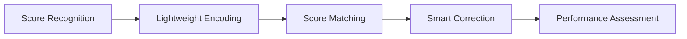

# 👋 Hi, I'm Lucas

**Building tools at the intersection of music, education, and code.**

---

## 🎹 About Me

- 🎓 Focused on **music education** and **score digitization**
- 🔭 Currently working on **[NoteLite](https://github.com/Lucas0623z/NoteLite)** — an OMR-based desktop platform for score recognition, structuring, and teaching feedback
- 🌱 Exploring **AI-assisted music workflows** (e.g. Gemini / Lyria integration)
- 💬 Ask me about **OMR**, **MusicXML**, **MIDI**, or **Java desktop apps**
- 📫 Reach me: open an [Issue](https://github.com/Lucas0623z/NoteLite/issues) or [Discussion](https://github.com/Lucas0623z/NoteLite/discussions) on NoteLite

---

## 🚀 Featured Project

### [NoteLite](https://github.com/Lucas0623z/NoteLite)

> An OMR-based platform for lightweight score structuring, error detection, and music-education evaluation.

| Capability | Description |
|------------|-------------|
| 📄 **OMR Pipeline** | PDF / image → transcription → MusicXML |
| 🎵 **MIDI Export** | Export `.mid` directly from the desktop app |
| 🇨🇳 **Localization** | Full Chinese UI (zh_CN) |
| 🖥️ **Desktop** | JDK 21, Gradle, cross-platform Java |

⬇️ [**Download latest release**](https://github.com/Lucas0623z/NoteLite/releases/latest)

---

## 🛠️ Tech Stack

  

**Domains:** Optical Music Recognition · MusicXML · MIDI · Desktop (Swing) · Build & Release

---

## 📊 GitHub Stats

  
  

  

---

## 🗺️ Roadmap (NoteLite)

---

## 📌 Pinned Repos

Check out my profile pins — usually **[NoteLite](https://github.com/Lucas0623z/NoteLite)** and related experiments.

---

*"From scanned score to structured data — one step closer to smarter music education."*

**⭐ If NoteLite helps you, a star on the repo means a lot!**

